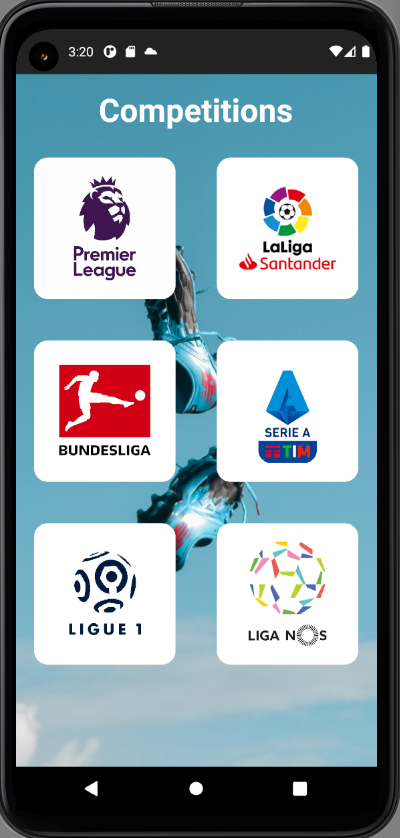
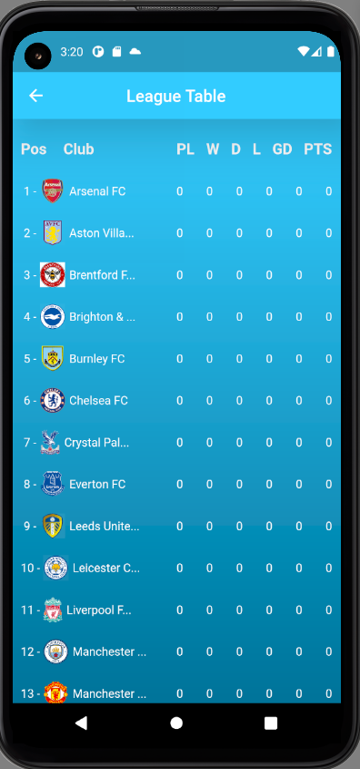
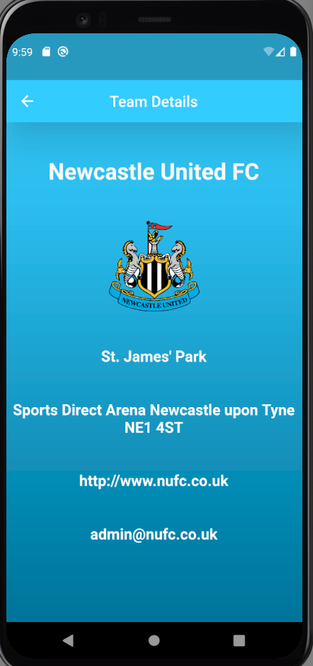

# football_api_app
Flutter Application using a football API

This app uses the free football api from [Football-data.org] (https://www.football-data.org/documentation/quickstart/)

Select your favorite footbal competition

See the current standings 

Select a team from the table to view the team details

  
